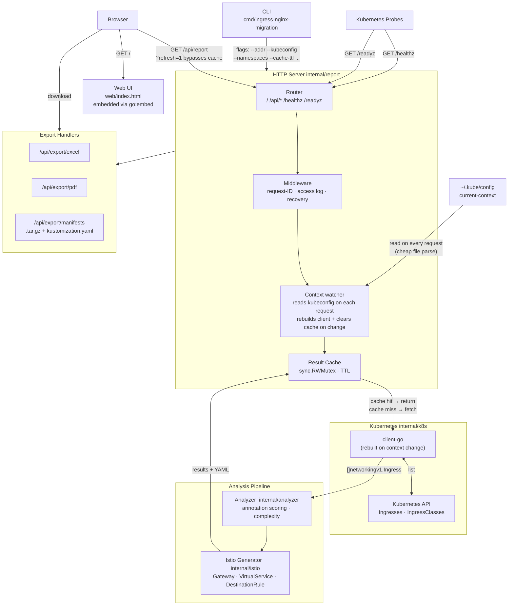

# nginx-ingress-to-istio

A CLI tool that connects to a Kubernetes cluster, analyzes NGINX Ingress resources, scores their migration complexity, and serves an interactive web report with ready-to-apply Istio YAML manifests.

## How it works



## Features

- Scans all (or selected) namespaces for NGINX Ingress resources
- Scores each ingress as **Low / Medium / High** complexity based on annotation weights
- Generates **Gateway**, **VirtualService**, and **DestinationRule** YAML stubs
- Serves an interactive web UI with search, filter, sort, and per-ingress YAML preview
- Exports the report as **Excel**, **PDF**, or a **`.tar.gz` manifest bundle** (kustomization-ready)
- In-process result cache with configurable TTL (`--cache-ttl`)
- **Live context switching** — detects `kubectl config use-context` changes, rebuilds the cluster connection, and clears the cache automatically; no server restart needed
- Health (`/healthz`) and readiness (`/readyz`) probes for Kubernetes deployments
- Request-ID stamping and access logging on all API endpoints

## Installation

**One-liner (Linux / macOS):**

```bash
curl -sSfL https://raw.githubusercontent.com/rohitsingh4334/nginx-ingress-to-istio/main/install.sh | bash
```

Install a specific version:

```bash
curl -sSfL https://raw.githubusercontent.com/rohitsingh4334/nginx-ingress-to-istio/main/install.sh | bash -s -- --version v0.1.0
```

**From source:**

```bash
git clone https://github.com/rohitsingh4334/nginx-ingress-to-istio.git
cd nginx-ingress-to-istio
make install   # builds and copies to /usr/local/bin
```

## Quick start

```bash
# Uses your current kubeconfig context
ingress-nginx-migration

# Open http://localhost:8080 in your browser
```

```bash
# Specific kubeconfig and namespaces
ingress-nginx-migration \
  --kubeconfig ~/.kube/config \
  --namespaces production,staging \
  --addr :9090
```

## CLI flags

| Flag | Default | Env | Description |
| --- | --- | --- | --- |
| `--addr` | `:8080` | `ADDR` | Address to listen on |
| `--kubeconfig` | _(in-cluster)_ | `KUBECONFIG` | Path to kubeconfig file |
| `--namespaces` | _(all)_ | `NAMESPACES` | Comma-separated namespace list |
| `--ingress-class` | _(auto-detect)_ | `INGRESS_CLASS` | IngressClass name to filter on |
| `--controller-class` | `k8s.io/ingress-nginx` | `CONTROLLER_CLASS` | Controller class to detect |
| `--watch-ingress-without-class` | `false` | `WATCH_INGRESS_WITHOUT_CLASS` | Include ingresses with no class annotation |
| `--ingress-class-by-name` | `false` | `INGRESS_CLASS_BY_NAME` | Also match by IngressClass name |
| `--connect-timeout` | `10s` | `CONNECT_TIMEOUT` | TCP connect timeout in DestinationRule |
| `--load-balancer` | `ROUND_ROBIN` | `LOAD_BALANCER` | Load balancer algorithm (`ROUND_ROBIN`, `LEAST_CONN`, `RANDOM`, `PASSTHROUGH`) |
| `--tls-mode` | `SIMPLE` | `TLS_MODE` | TLS mode for Gateway (`SIMPLE`, `MUTUAL`, `PASSTHROUGH`, `AUTO_PASSTHROUGH`, `ISTIO_MUTUAL`) |
| `--cache-ttl` | `15s` | `CACHE_TTL` | How long to cache analysis results (`0` disables caching) |

## Web UI

Open `http://localhost:8080` after starting the tool.

- **Summary cards** — total ingress count broken down by complexity
- **Search** — filter by name, namespace, or hostname (200 ms debounce)
- **Filter & sort** — by complexity or name
- **Per-ingress cards** — expandable, with tabs for Rules, Annotations, and the three generated YAML resources
- **Copy buttons** — copy individual YAML tabs, or **Copy All YAML** to get all three documents concatenated with `---` separators
- **Download Excel / PDF** — full report in spreadsheet or document form
- **Download Manifests** — `.tar.gz` archive (layout below); apply with `kubectl apply -k .` after extracting
- **Refresh** — bypasses the cache and re-fetches live from the cluster; switching context with `kubectl config use-context` is picked up automatically on the next request
- **Light / dark theme** — persisted in `localStorage`

```text
<namespace>/<name>/gateway.yaml
<namespace>/<name>/virtual-service.yaml
<namespace>/<name>/destination-rule.yaml
kustomization.yaml
```

## API endpoints

| Method | Path | Description |
| --- | --- | --- |
| `GET` | `/api/report` | JSON analysis report (`?refresh=1` bypasses cache) |
| `GET` | `/api/cluster-info` | Current kubeconfig context, cluster name, and server URL |
| `GET` | `/api/export/excel` | Excel workbook download |
| `GET` | `/api/export/pdf` | PDF report download |
| `GET` | `/api/export/manifests` | `.tar.gz` Istio manifest bundle |
| `GET` | `/healthz` | Liveness probe — always `200 ok` while the process is up |
| `GET` | `/readyz` | Readiness probe — `200 ok` once the listener is accepting connections |

## Complexity scoring

Each NGINX annotation carries a weight. Weights are summed per ingress to produce a score:

| Score | Complexity | Meaning |
| --- | --- | --- |
| 0 | **Low** | No NGINX-specific annotations — generate Gateway + VirtualService from rules only |
| 1–4 | **Medium** | Annotations with a direct or near-direct Istio equivalent; config changes required |
| > 4 | **High** | Annotations with no direct equivalent, or unknown annotations; EnvoyFilter work likely required |

**Weight reference:**

| Weight | Examples |
| --- | --- |
| +1 | `ssl-redirect`, `force-ssl-redirect`, `proxy-read-timeout`, `proxy-connect-timeout`, `proxy-send-timeout`, `cors-allow-methods`, `cors-allow-headers`, `load-balance`, `use-regex`, `permanent-redirect`, `temporal-redirect`, `from-to-www-redirect` |
| +2 | `rewrite-target`, `backend-protocol`, `enable-cors`, `cors-allow-origin`, `proxy-body-size`, `upstream-hash-by`, `canary`, `canary-weight`, `canary-by-header`, `app-root`, `whitelist-source-range`, `satisfy` |
| +3 | `auth-type`, `auth-url`, `auth-secret`, `limit-rps`, `limit-connections`, `ssl-passthrough`, `configuration-snippet`, `server-snippet`, _any unrecognised annotation_ |

## Building from source

Requirements: Go 1.22+

```bash
make build          # → dist/ingress-nginx-migration (current platform)
make build-all      # → linux/amd64, linux/arm64, darwin/amd64, darwin/arm64
make test           # unit tests
make lint           # golangci-lint (requires golangci-lint in PATH)
```

### End-to-end tests

E2e tests spin up a k3s cluster with [testcontainers-go](https://github.com/testcontainers/testcontainers-go) and require a running Docker daemon (Colima works on macOS).

```bash
make e2e-test

# Reuse the same cluster across runs (faster iteration):
E2E_REUSE_CLUSTER=true make e2e-test
```

## Running in-cluster

The tool works in-cluster without a `--kubeconfig` flag — it uses the pod's service account. The service account needs `get` and `list` on `ingresses` and `ingressclasses` across the namespaces you want to analyze.

Minimal RBAC:

```yaml
apiVersion: rbac.authorization.k8s.io/v1
kind: ClusterRole
metadata:
  name: ingress-nginx-migration
rules:
  - apiGroups: ["networking.k8s.io"]
    resources: ["ingresses", "ingressclasses"]
    verbs: ["get", "list"]
---
apiVersion: rbac.authorization.k8s.io/v1
kind: ClusterRoleBinding
metadata:
  name: ingress-nginx-migration
roleRef:
  apiGroup: rbac.authorization.k8s.io
  kind: ClusterRole
  name: ingress-nginx-migration
subjects:
  - kind: ServiceAccount
    name: ingress-nginx-migration
    namespace: default
```

Use `/healthz` and `/readyz` as liveness and readiness probes respectively.

## License

[MIT](LICENSE)
